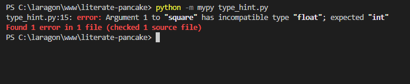
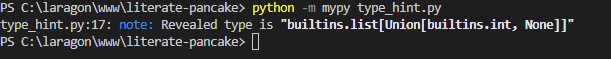
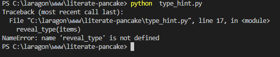

# <center>Python : Type Hint</center>
<p align="center">
  
</p>

# <center>Introduction</center>
Python est un langage de programmation puissant et facile à apprendre. Il dispose de structures de données de haut niveau et permet une approche simple mais efficace de la programmation orientée objet. Parce que sa syntaxe est élégante, que son typage est dynamique et qu'il est interprété, Python est un langage idéal pour l'écriture de scripts et le développement rapide d'applications dans de nombreux domaines et sur la plupart des plateformes.

L'interpréteur Python et sa vaste bibliothèque standard sont disponibles librement, sous forme de sources ou de binaires, pour toutes les plateformes majeures depuis le site Internet https://www.python.org/ et peuvent être librement redistribués. 

# <center>Type Hints in Python</center>
L’un des points positifs du langage est le gain en productivité pendant le développement d’applications web par rapport à d’autres langages à typage statique comme Java ou C++. Par conséquent, un gain de temps précieux pour les entreprises qui font de plus en plus le choix de Python.

Paradoxalement, la simplicité de Python peut devenir problématique. Les applications sont plus rapidement en production mais elles peuvent également contenir plus de bugs. L’une des critiques souvent évoquées sur Python est son typage dynamique. En effet, le type de variables est assigné lors de la déclaration et il peut être modifié pendant l’interprétation du code. Pour pallier cette problématique, Python 3.5 a introduit le « type hinting » (PEP484: Type Hints).

<!-- Python est un langage à typage dynamique, ce qui signifie que vous n'avez jamais à indiquer explicitement le type de type de variable. Mais dans certains cas, le typage dynamique peut entraîner des bogues très difficiles à déboguer et dans ces cas, les conseils de type ou le typage statique peuvent être pratiques. -->

Python supporte des annotations de type (ou type hints) optionnelles.

Ces annotations de type constituent une syntaxe spéciale qui permet de déclarer le type d'une variable.

En déclarant les types de vos variables, cela permet aux différents outils comme les éditeurs de texte d'offrir un meilleur support.

## La syntaxe
Prenons un exemple simple :
```python
def get_full_name(first_name, last_name):
    full_name = first_name.title() + " " + last_name.title()
    return full_name

print(get_full_name("Amadou", "Ndiaye"))
```
Exécuter ce programe affiche :
```python
Amadou Ndiaye
```

Modifions une seule ligne de la version précédente.

Nous allons changer seulement cet extrait, les paramètres de la fonction, de :
Exécuter ce programe affiche :
```python
first_name, last_name
```
à :
```python
first_name: str, last_name: str
```
Ce sont des annotations de types :
```python
def get_full_name(first_name: str, last_name: str):
    full_name = first_name.title() + " " + last_name.title()
    return full_name

print(get_full_name("Fatou", "Thiva"))

# Affichage
Fatou Thiva
```
Le typage se fait grâce aux annotations. Elles permettent d’associer un type donné (`List, bool, etc`) aux arguments et aux retours des fonctions.

Les types primitifs sont les plus récurrents et utilisés : `bool, int, str, float`. Ils peuvent être utilisés pour typer les arguments ainsi que les retours des fonctions.

Prenons un autre exemple, une fonction qui prend en entrée un parèmetre de type `float`et la réponse est de type `float`:
```python
import math

def circle_surface(radius: float) -> float:
    return 3.141516 * math.sqrt(radius)

circle = circle_surface(3.65)

print(circle) //6.001857890739701
```
Dans l’exemple ci-dessus, la fonction `circle_surface` prend en argument le rayon du cercle (le `radius`) et calcule la surface de ce cercle. Cet argument est de type `float` (indiqué après le `:` suivant le nom de l’argument) et la réponse est elle aussi de type `float` (le type de retour est indiqué après la flèche `->`).


Si vous travaillez avec une fonction qui ne devrait rien renvoyer, vous pouvez spécifier `None` comme type de retour :
```python
def add_numbers(num1 : int, num2 : int) -> Aucun : 
    print(num1 + num2)

add_numbers(3, 5) # 8
```

Maintenant que nous savons comment le typage fonction, voyons que se passe-t-il si nous décidons d'appeler la `add_numbers()` fonction avec des nombres à virgule flottante :

```python
def add_numbers(num1 : int, num2 : int) -> int : 
    retour num1 + num2

print(add_numbers(3.5, 5.11)) # 8.61
```
On constate que la fonction marche toujours malgrès l'ajout d'indicateurs de type.

Nous devons donc utiliser un vérificateur de type statique qui analyse notre code et essaie de détecter si nous enfreignons ou non nos Type-Hints.

#### MyPy
Le vérificateur de type le plus connu est « `MyPy` ». MyPy donnera de la visibilité sur les incohérences de types et cela permettra de mieux comprendre d’où vient le problème.
Nous pouvons l'installer en utilisant soit `pip` ou `conda` :
```python
pip install mypy  #pip
conda install mypy #conda
```
Ensuite, créons un fichier Python. 
```python
def square(number: int) -> int:
    return number ** 2

if __name__ == '__main__':
    print(square(3))
    print(square(3.14))
```

La fonction accepte l'entier et le met au carré, au moins selon les indications de type. Lors de l'exécution, la fonction est évaluée à la fois avec un entier et un flottant.

Pour exécuter le code maintenant, nous devons simplement appeler l'interpréteur Python et nous devons spécifier "-m" pour indiquer que nous voulons charger un module, puis spécifier le script que nous voulons vérifier. Par exemple: `python -m mypy type_hint.py`


</img>

Comme vous pouvez le voir, `mypy` fonctionne comme annoncé.
Ceci n'exécutera pas réellement notre program mais il l'analysera et nous donnera une erreur du type `error: Argument 1 to "square" has incompatible type "float"; expected "int"` qui est un message très clair et qui nous facilite beaucoup le débogage de notre code.

 le message nous indique que la fonction `square` attend comme argument un entier `int` alors que l'argument passé est de type `float`

#### Les fonctions reveal_type(exp) et/ou reveal_locals

Elles produisent un rapport sur les expressions en paramètre ou sur les variables dans le scope.
Prenons par exemple ce code :
```python
items = =  [ 1 ,  None ]
```
Nous n'avons pas besoin d'ajouter un indice à `items` car notre vérificateur de type peut déduire son type. Mais nous pourrions ne pas être sûrs du type qui a été déduit - est-ce `list[int | None]`, ou `list[object]` ou encore `list[Any]`.
 On peut vérifier en ajoutant la fonction `reveal_type` 
```python
items = [1, None]
reveal_type(items)
```
</img>
Ici, `mypy` nous révele que `items` est de type : `list[int | None]` 

Notez que `reveal_type()` n'existe pas au moment de l'exécution, donc si nous exécutons notre code avec l'appel en place, nous aurons une erreur :
</img>
[this is the description](https://google.com)


this variable has some `variable` inline codee


