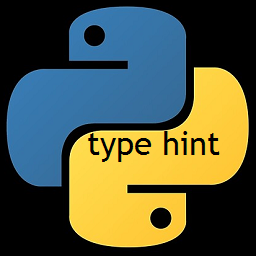
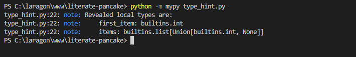

# <center>Python : Type Hint</center>
<p align="center">
  
</p>

# <center>Table des matières</center>

* Introduction
* Type Hints in Python
  * La syntaxe
  * MyPy
  * Les fonctions reveal_type(exp) et/ou reveal_locals
  * Types génériques avec des paramètres de types
  * Utilisation des types au moment de l'exécution
  * Autres vérificateurs de type statique
* Conclusion

<div style="page-break-after: always"></div>

# Introduction
Python est un langage de programmation puissant et facile à apprendre. Il dispose de structures de données de haut niveau et permet une approche simple mais efficace de la programmation orientée objet. Parce que sa syntaxe est élégante, que son typage est dynamique et qu'il est interprété. Python est un langage idéal pour l'écriture de scripts et le développement rapide d'applications dans de nombreux domaines et sur la plupart des plateformes.

L'interpréteur Python et sa vaste bibliothèque standard sont disponibles librement, sous forme de sources ou de binaires, pour toutes les plateformes majeures depuis le site Internet https://www.python.org/ et peuvent être librement redistribués. 

# Type Hints in Python

L’un des points positifs du langage est le gain en productivité pendant le développement d’applications web par rapport à d’autres langages à typage statique comme Java ou C++. Par conséquent, un gain de temps précieux pour les entreprises qui font de plus en plus le choix de Python.

Paradoxalement, la simplicité de Python peut devenir problématique. Les applications sont plus rapidement en production mais elles peuvent également contenir plus de bugs. L’une des critiques souvent évoquées sur Python est son typage dynamique. En effet, le type de variables est assigné lors de la déclaration et il peut être modifié pendant l’interprétation du code. Pour pallier cette problématique, Python 3.5 a introduit le « type hinting » (PEP484: Type Hints).

Python supporte des annotations de type (ou type hints) optionnelles.

Ces annotations de type constituent une syntaxe spéciale qui permet de déclarer le type d'une variable.

En déclarant les types de vos variables, cela permet aux différents outils comme les éditeurs de texte d'offrir un meilleur support.

## La syntaxe
Prenons un exemple simple :
```python
def get_full_name(first_name, last_name):
    full_name = first_name.title() + " " + last_name.title()
    return full_name

print(get_full_name("Amadou", "Ndiaye"))
```
Exécuter ce programe affiche :
```python
Amadou Ndiaye
```

Modifions une seule ligne de la version précédente.

Nous allons changer seulement cet extrait, les paramètres de la fonction:
Exécuter ce programe affiche :
```python
first_name, last_name
```
à :
```python
first_name: str, last_name: str
```
Ce sont des annotations de types :
```python
def get_full_name(first_name: str, last_name: str):
    full_name = first_name.title() + " " + last_name.title()
    return full_name

print(get_full_name("Fatou", "Thiva"))

# Affichage
Fatou Thiva
```
Le typage se fait grâce aux annotations. Elles permettent d’associer un type donné (`List, bool, etc`) aux arguments et aux retours des fonctions.

Les types primitifs sont les plus récurrents et utilisés : `bool, int, str, float`. Ils peuvent être utilisés pour typer les arguments ainsi que les retours des fonctions.

Prenons un autre exemple, une fonction qui prend en entrée un parèmetre de type `float`et la réponse est de type `float`:
```python
import math

def circle_surface(radius: float) -> float:
    return 3.141516 * math.sqrt(radius)

circle = circle_surface(3.65)

print(circle) //6.001857890739701
```
Dans l’exemple ci-dessus, la fonction `circle_surface` prend en argument le rayon du cercle (le `radius`) et calcule la surface de ce cercle. Cet argument est de type `float` (indiqué après le `:` suivant le nom de l’argument) et la réponse est elle aussi de type `float` (le type de retour est indiqué après la flèche `->`).


Si vous travaillez avec une fonction qui ne devrait rien renvoyer, vous pouvez spécifier `None` comme type de retour :
```python
def add_numbers(num1 : int, num2 : int) -> None : 
    print(num1 + num2)

add_numbers(3, 5) # 8
```

Maintenant que nous savons comment le typage fonctionne, voyons que se passe-t-il si nous décidons d'appeler la fonction `add_numbers()` avec des nombres à virgule :

```python
def add_numbers(num1 : int, num2 : int) -> int : 
    return num1 + num2

print(add_numbers(3.5, 5.11)) # 8.61
```
On constate que la fonction marche toujours malgrès l'ajout d'indicateurs de type.

Nous devons donc utiliser un vérificateur de type statique qui analyse notre code et essaie de détecter si nous enfreignons ou non nos Type-Hints.

#### MyPy
Le vérificateur de type le plus connu est « `MyPy` ». `MyPy` donnera de la visibilité sur les incohérences de types et cela permettra de mieux comprendre d’où vient le problème.
Nous pouvons l'installer en utilisant soit `pip` ou `conda` :
```python
pip install mypy  #pip
conda install mypy #conda
```
Ensuite, créons un fichier Python. 
```python
def square(number: int) -> int:
    return number ** 2

if __name__ == '__main__':
    print(square(3))
    print(square(3.14))
```

La fonction accepte l'entier et le met au carré, au moins selon les indications de type. Lors de l'exécution, la fonction est évaluée à la fois avec un entier et un flottant.

Pour exécuter le code maintenant, nous devons simplement appeler l'interpréteur Python et nous devons spécifier "`-m`" pour indiquer que nous voulons charger un module, puis spécifier le script que nous voulons vérifier.
Par exemple: `python -m mypy type_hint.py`


</img>

Comme vous pouvez le voir, `MyPy` fonctionne comme annoncé.
Ceci n'exécutera pas réellement notre programme mais il l'analysera et nous donnera une erreur du type `error: Argument 1 to "square" has incompatible type "float"; expected "int"` qui est un message très clair et qui nous facilite beaucoup le débogage de notre code.

 le message nous indique que la fonction `square` attend comme argument un entier `int` alors que l'argument passé est de type `float`

#### Les fonctions reveal_type(exp) et/ou reveal_locals

* <strong>reveal_type(exp)</strong>

Elles produisent un rapport sur les expressions en paramètre ou sur les variables dans le scope.
Prenons par exemple ce code :
```python
items = [ 1 ,  None ]
```
Nous n'avons pas besoin d'ajouter un indice à `items` car notre vérificateur de type peut déduire son type. Mais nous pourrions ne pas être sûrs du type qui a été déduit - est-ce `list[int | None]`, ou `list[object]` ou encore `list[Any]`.
 On peut vérifier en ajoutant la fonction `reveal_type` 
```python
items = [1, None]
reveal_type(items)
```
</img>
Ici, `mypy` nous révele que `items` est de type : `list[int | None]` 

Notez que `reveal_type()` n'existe pas au moment de l'exécution, donc si nous exécutons notre code avec l'appel en place, nous aurons une erreur :
</img>

* <strong>reveal_locals()</strong>

`MyPy` prend également en charge `reveal_locals()` , qui fait un `reveal_type()` pour chaque variable locale. Cela peut faire gagner du temps lors du débogage de plusieurs variables.

Par exemple, si nous prenons ce code :
```python
CONSTANT = 1


def example() -> None:
    first_item = 1
    items = [first_item, None]
    reveal_locals()
```
Nous pouvons exécuter Mypy et voir :
</img>

Les variables locales `first_item` et `items` sont les types révélés, mais pas la variable globale `CONSTANT`.

#### Types génériques avec des paramètres de types

Il existe certaines structures de données qui contiennent d'autres valeurs, comme `dict`, `list`, `set` et `tuple`. Et les valeurs internes peuvent elles aussi avoir leurs propres types.

Pour déclarer ces types et les types internes, on utilise le module standard de Python `typing`.

Le module de Python `typing` peut rendre les annotations de type de données encore plus détaillées. Par exemple, vous pouvez créer des types composés comme des listes d’entiers (`integer`) ou comme dans cet example des listes de nombres flottants (`float`).

Voici comment:
```python
from typing import List

Vector = List[float]

def scale(scalar: float, vector: Vector) -> Vector:
    return [scalar * num for num in vector]


print(scale(2.14, [1.0, 3.14])) # [2.14, 6.719600000000001]
```

<strong>NB:</strong> Ces types internes entre crochets sont appelés des "paramètres de type". Ici, `float` est un paramètre de type passé à List.

On peut aussi déclarer une classe comme type d'une variable.
Voici comment : On a une classe `Person` avec une variable `name`
```python
class Person:
    def __init__(self, name: str):
        self.name = name


def get_person_name(one_person: Person):
    return one_person.name

```
<div style="page-break-after: always"></div>

#### Utilisation des types au moment de l'exécution
Il est possible d'utiliser des type Hints également lors de l'exécution de votre programme Python. La vérification du type d'exécution ne sera probablement jamais prise en charge nativement dans Python.

Cependant, les type hints sont disponibles au moment de l'exécution dans le __annotations__dictionnaire et vous pouvez les utiliser pour effectuer des vérifications de type.
il existe déjà plusieurs packages qui le font pour vous tels que `Enforce`, `Pydantic` ou `Pytype`.

### Autres vérificateurs de type statique

Il existe d'autres vérificateurs de type statiques dans l'écosystème Python.

L' éditeur `PyCharm` est livré avec son propre vérificateur de type inclus. Si vous utilisez `PyCharm` pour écrire votre code Python, il sera automatiquement vérifié.

Facebook a développé `Pyre`. L'un de ses objectifs déclarés est d'être rapide et performant. Bien qu'il existe quelques différences, `Pyre` fonctionne principalement de la même manière que Mypy.

De plus, Google a créé `Pytype`. Ce vérificateur de type fonctionne également de la même manière que Mypy. En plus de vérifier le code annoté, `Pytype` prend en charge l'exécution de vérifications de type sur du code non annoté et même l'ajout automatique d'annotations au code.

# Conclusion
Le type hint ou annotation de type en Python est une fonctionnalité très utile dont vous pouvez vous passer sans problème. Les annotations de type ne vous rendent pas capable d'écrire du code que vous ne pouvez pas écrire sans utiliser les indications de type. Au lieu de cela,il vous permet de raisonner plus facilement sur le code, de trouver des bogues subtils et de maintenir une architecture propre.

